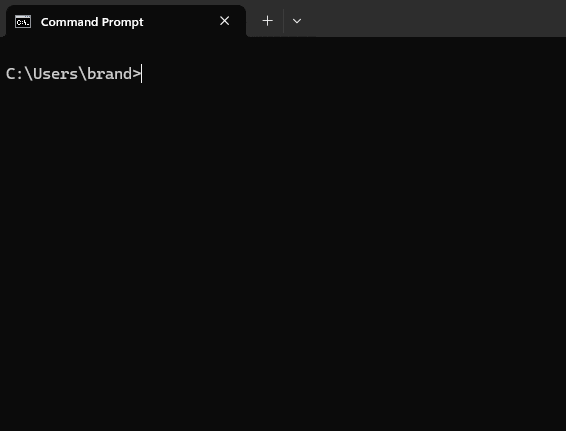

<div align="center">

</div>

# se – Save and Execute

`se` is a command-line utility written in Rust that allows you to save commands and then conveniently execute then at any time.

To use it you can either execute `se <action>` for each action you want to perform or run `se` to enter a simple custom command-line interface.

## Preview



## Usage

```text
usage: se <action> <identifier>

<action> is one of:
    -a, add    Add a new command using the given <identifier> as the initial name.
    -d, del    Delete the specified command.
    -e, edit   Edit the specified command.
    -h, help   Show this help message. <identifier> is ignored.
    -l, list   Show the command list. This is the default action when no <identifier> is given. <identifier> is ignored.
    -m, move   Move the specified command to a new position on the command list.
    -r, run    Run the specified command. This is the default action when only a <identifier> is given.

<identifier> is either the name of the command or the index of the command on the command list.
```

## Integrations

The Windows installer offers integration into the Windows Terminal and the system path.

## Developing

`se` is built using Cargo and Rust. Once those are installed run `cargo install` to install dependencies and `cargo run` to run the app. See Cargo for more options.

The Windows installer is built from `install.iss` with Inno Setup.
